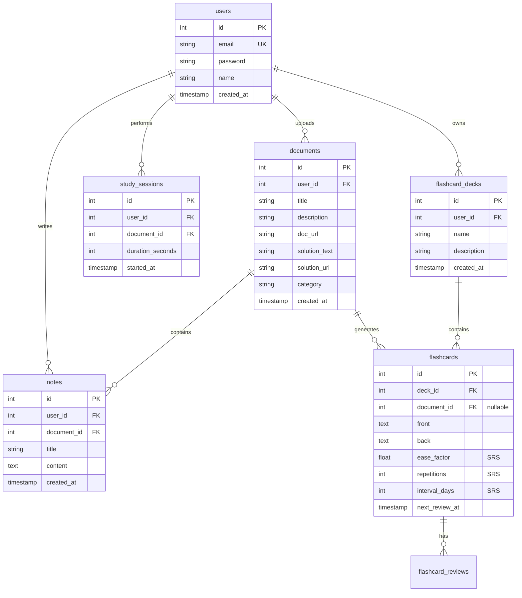

# 📚 KẾ HOẠCH TRIỂN KHAI: NỀN TẢNG CHIA SẺ TÀI LIỆU & HỌC TẬP THÔNG MINH (EDUSHARE AI)

Dự án này là một nền tảng Web học tập toàn diện cho phép người dùng chia sẻ tài liệu học tập, học cùng trợ lý trí tuệ nhân tạo (AI), ghi chép thông minh, học bằng Flashcard và thiết lập thời gian học tập tập trung.

---

## 🎯 1. Các Tính Năng Cốt Lõi (Core Features)

1. **Tải lên & Quản lý Tài liệu kèm Lời giải**:
   * Người dùng có thể upload tài liệu (PDF, Word, Ảnh).
   * Đi kèm với tài liệu là phần lời giải chi tiết hoặc đáp án (bản text/markdown hoặc tệp đính kèm).
   * Phân loại theo môn học, thẻ tag, lớp học hoặc cấp độ.

2. **Xem Tài liệu & Đặt thời gian học (Study Timer)**:
   * Trình xem tài liệu trực quan (Document Viewer).
   * Widget đồng hồ đếm ngược Pomodoro hoặc tùy chỉnh thời gian học tập trực tiếp bên cạnh tài liệu nhằm duy trì sự tập trung.
   * Ghi nhận tiến độ học tập (Thời gian đã học trên tài liệu đó).

3. **Học cùng trợ lý AI (Study with AI)**:
   * Chatbox AI tích hợp ngay bên cạnh giao diện đọc tài liệu.
   * AI có khả năng phân tích nội dung tài liệu để trả lời câu hỏi, tóm tắt kiến thức, hoặc giải thích các đoạn văn/công thức khó.
   * AI hỗ trợ tự động tạo câu hỏi trắc nghiệm/tự luận từ tài liệu để kiểm tra kiến thức của người dùng.

4. **Ghi chép thông minh (Interactive Notes)**:
   * Tạo ghi chú dạng Rich Text/Markdown trong quá trình đọc tài liệu.
   * Các ghi chú được tự động lưu trữ và liên kết trực tiếp với tài liệu đang học.

5. **Hệ thống Flashcards học tập**:
   * Người dùng có thể tạo bộ thẻ ghi nhớ (Flashcards) thủ công hoặc nhờ AI tự động tạo từ tài liệu vừa học.
   * Tích hợp thuật toán lặp lại ngắt quãng (Spaced Repetition) để tối ưu hóa việc ghi nhớ.

---

## 🐳 2. Hướng Dẫn Setup Docker & pgAdmin Chi Tiết

Dự án đã được cấu hình Monorepo chạy hoàn chỉnh thông qua Docker Compose bao gồm:
* **Frontend (Port 3000)**: Next.js App
* **Backend (Port 5000)**: Express.js (Node.js) API
* **PostgreSQL (Port 5432)**: Database chính
* **pgAdmin (Port 5050)**: Giao diện quản lý Database trực quan

### Bước 1: Chuẩn bị biến môi trường `.env`
Bạn cần có đủ 3 file cấu hình môi trường dưới đây trước khi chạy Docker:

1. **File `.env` ở thư mục gốc (Root)**:
   *(Đã được Jarvis tạo tự động để cấu hình Database và pgAdmin)*
   ```env
   POSTGRES_USER=your_username
   POSTGRES_PASSWORD=your_password
   POSTGRES_DB=name_app
   PGADMIN_DEFAULT_EMAIL=admin@example.com
   PGADMIN_DEFAULT_PASSWORD=admin
   ```

2. **File `backend/.env`**:
   *(Hãy copy từ `backend/.env.example` và điều chỉnh nếu cần)*
   ```bash
   cd backend
   cp .env.example .env
   ```
   *Lưu ý: Mật khẩu và username phải đồng nhất với file `.env` ở Root.*

3. **File `frontend/.env.local`**:
   *(Hãy copy từ `frontend/.env.example`)*
   ```bash
   cd frontend
   cp .env.example .env.local
   ```

---

### Bước 2: Khởi động Docker Compose

Từ thư mục gốc của dự án, chạy lệnh sau trong PowerShell hoặc Command Prompt để xây dựng và kích hoạt toàn bộ các Container:

```bash
docker-compose up -d --build
```

> **Giải thích lệnh**:
> * `up`: Khởi tạo và chạy các services.
> * `-d` (detached mode): Chạy ngầm trong nền, giải phóng dòng lệnh terminal.
> * `--build`: Biên dịch lại các Dockerfile nếu có thay đổi trong code nguồn.

Khi chạy thành công, bạn sẽ thấy 4 container hoạt động ở trạng thái xanh.

---

### Bước 3: Cấu hình và Sử dụng pgAdmin để quản lý Database

1. Truy cập vào giao diện pgAdmin tại: [http://localhost:5050](http://localhost:5050)
2. **Đăng nhập**: 
   * Email: `admin@example.com` *(theo cấu hình `PGADMIN_DEFAULT_EMAIL` trong `.env` root)*
   * Password: `admin` *(theo cấu hình `PGADMIN_DEFAULT_PASSWORD` trong `.env` root)*

3. **Kết nối đến PostgreSQL Database của dự án**:
   * Nhấp chuột phải vào mục **Servers** -> Chọn **Register** -> **Server...**
   * Trong tab **General**:
     * Đặt tên gợi nhớ (ví dụ: `EduShareDB`).
   * Trong tab **Connection**:
     * **Host name/address**: Điền `postgres` (đây là tên service trong Docker-compose, Docker sẽ tự động phân giải IP nội bộ). Tuyệt đối **không** dùng `localhost` khi cấu hình trong pgAdmin chạy Docker.
     * **Port**: `5432`
     * **Maintenance database**: `name_app`
     * **Username**: `your_username`
     * **Password**: `your_password`
     * Tích chọn **Save password** để không phải nhập lại lần sau.
   * Nhấn **Save**. Bạn sẽ thấy toàn bộ cấu trúc bảng và cơ sở dữ liệu hiện ra ở thanh bên trái!

---

### Bước 4: Chạy Migrations cập nhật Database

Mỗi khi có sự thay đổi về cấu trúc bảng (thêm bảng mới cho tài liệu, flashcard, note...), hãy chạy lệnh sau để cập nhật cơ sở dữ liệu ngay bên trong Docker Container của backend:

```bash
docker-compose exec backend npm run migrate:up
```

---

## 💾 3. Thiết Kế Cơ Sở Dữ Liệu (Database Schema)

Để đáp ứng đầy đủ tính năng đã đề xuất, chúng ta sẽ thiết kế các bảng sau (sử dụng `node-pg-migrate`):



---

## 🛠️ 4. API Endpoints Thiết Yếu (Backend)

### 📂 Quản lý tài liệu (`/api/documents`)
* `POST /` - Tải lên tài liệu kèm lời giải (Hỗ trợ file upload qua Multer + Cloudinary).
* `GET /` - Liệt kê tất cả tài liệu (có bộ lọc tìm kiếm theo tên, danh mục).
* `GET /:id` - Xem chi tiết một tài liệu kèm lời giải chi tiết.
* `DELETE /:id` - Xóa tài liệu (chỉ chủ sở hữu).

### ⏱️ Học tập & Đếm giờ (`/api/study-sessions`)
* `POST /start` - Bắt đầu một phiên học trên tài liệu.
* `POST /end` - Kết thúc phiên học, cập nhật thời gian học tích lũy.
* `GET /stats` - Xem thống kê thời gian học tập của người dùng.

### 🤖 Trợ lý AI (`/api/ai`)
* `POST /chat` - Chat trực tiếp với AI theo tài liệu (Gửi kèm `documentId` và câu hỏi của người dùng để nạp ngữ cảnh cho Gemini AI).
* `POST /generate-quiz` - AI tự động đọc tài liệu và tạo ra bộ câu hỏi trắc nghiệm ôn tập.
* `POST /generate-flashcards` - AI tự động phân tích tài liệu và xuất ra danh sách câu hỏi Flashcard.

### 📝 Ghi chú (`/api/notes`)
* `POST /` - Tạo ghi chú mới liên kết với tài liệu.
* `GET /document/:docId` - Lấy tất cả ghi chú của tài liệu hiện tại.
* `PUT /:id` - Cập nhật nội dung ghi chú.
* `DELETE /:id` - Xóa ghi chú.

### 🎴 Thẻ ghi nhớ Flashcards (`/api/flashcards`)
* `POST /decks` - Tạo bộ Flashcard mới.
* `GET /decks` - Danh sách bộ Flashcard.
* `POST /` - Thêm thẻ ghi nhớ thủ công hoặc từ AI.
* `POST /review/:id` - Đánh giá độ khó sau khi học thẻ (Cập nhật thuật toán lặp lại ngắt quãng SRS).

---

## 🚀 5. Lộ Trình Phát Triển (Roadmap)

- [x] **Giai đoạn 1**: Thiết kế ý tưởng & Kiến trúc dữ liệu.
- [ ] **Giai đoạn 2**: Tạo các file Migration cơ sở dữ liệu (`documents`, `notes`, `flashcards`, `sessions`).
- [ ] **Giai đoạn 3**: Phát triển API Backend cho việc Đăng ký/Đăng nhập, Upload tài liệu và quản lý Note.
- [ ] **Giai đoạn 4**: Tích hợp API Gemini AI vào backend (Phân tích tài liệu, Trả lời câu hỏi học tập).
- [ ] **Giai đoạn 5**: Thiết kế giao diện Frontend Premium (Document Viewer + Widget Timer, Sidebar AI Chat, Note editor & Flashcards board).
- [ ] **Giai đoạn 6**: Ghép nối dữ liệu (API Integration), tối ưu hóa trải nghiệm người dùng & đóng gói dự án.
