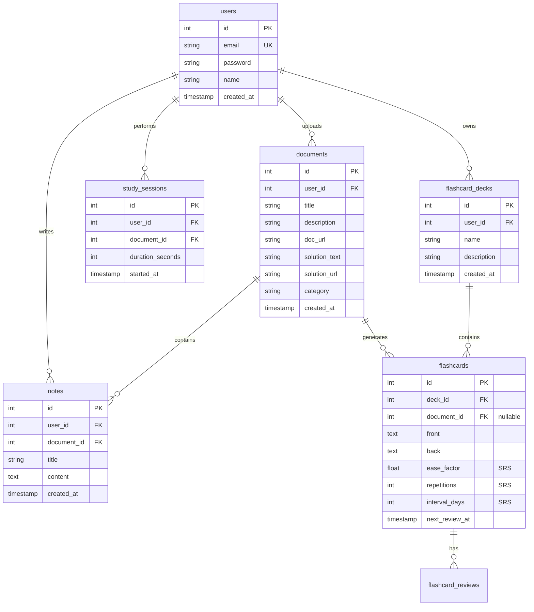
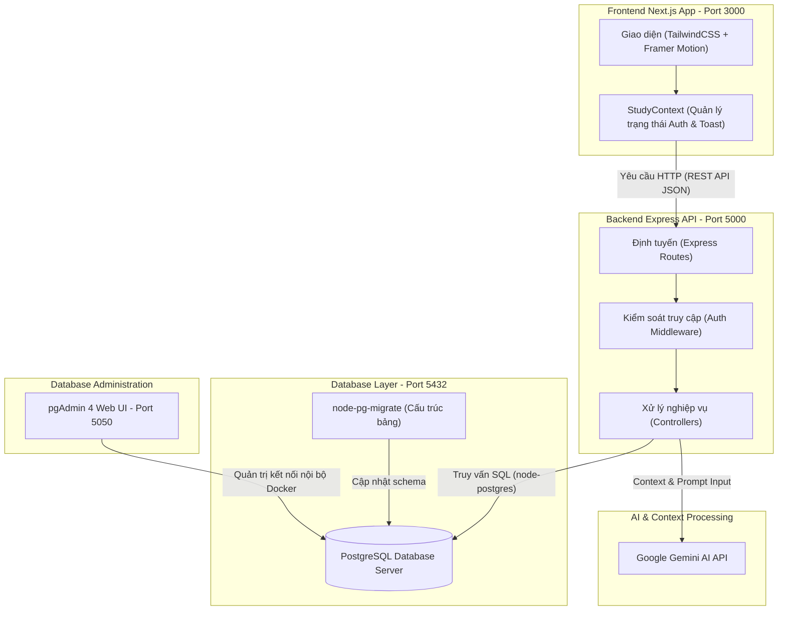

# 📚 KẾ HOẠCH TRIỂN KHAI: NỀN TẢNG CHIA SẺ TÀI LIỆU & HỌC TẬP THÔNG MINH (EDUSHARE AI)

Dự án này là một nền tảng Web học tập toàn diện cho phép người dùng chia sẻ tài liệu học tập, học cùng trợ lý trí tuệ nhân tạo (AI), ghi chép thông minh, học bằng Flashcard và thiết lập thời gian học tập tập trung.

---

## 🎯 1. Các Tính Năng Cốt Lõi (Core Features)

1. **Tải lên & Quản lý Tài liệu kèm Lời giải**:
   * Người dùng có thể upload tài liệu (PDF, Word, Ảnh).
   * Đi kèm với tài liệu là phần lời giải chi tiết hoặc đáp án (bản text/markdown hoặc tệp đính kèm).
   * Phân loại theo môn học, thẻ tag, lớp học hoặc cấp độ.

2. **Xem Tài liệu & Đặt thời gian học (Study Timer)**:
   * Trình xem tài liệu trực quan (Document Viewer).
   * Widget đồng hồ đếm ngược Pomodoro hoặc tùy chỉnh thời gian học tập trực tiếp bên cạnh tài liệu nhằm duy trì sự tập trung.
   * Ghi nhận tiến độ học tập (Thời gian đã học trên tài liệu đó).

3. **Học cùng trợ lý AI (Study with AI)**:
   * Chatbox AI tích hợp ngay bên cạnh giao diện đọc tài liệu.
   * AI có khả năng phân tích nội dung tài liệu để trả lời câu hỏi, tóm tắt kiến thức, hoặc giải thích các đoạn văn/công thức khó.
   * AI hỗ trợ tự động tạo câu hỏi trắc nghiệm/tự luận từ tài liệu để kiểm tra kiến thức của người dùng.

4. **Ghi chép thông minh (Interactive Notes)**:
   * Tạo ghi chú dạng Rich Text/Markdown trong quá trình đọc tài liệu.
   * Các ghi chú được tự động lưu trữ và liên kết trực tiếp với tài liệu đang học.

5. **Hệ thống Flashcards học tập**:
   * Người dùng có thể tạo bộ thẻ ghi nhớ (Flashcards) thủ công hoặc nhờ AI tự động tạo từ tài liệu vừa học.
   * Tích hợp thuật toán lặp lại ngắt quãng (Spaced Repetition) để tối ưu hóa việc ghi nhớ.

---

## 🐳 2. Hướng Dẫn Setup Docker & pgAdmin Chi Tiết

Dự án đã được cấu hình Monorepo chạy hoàn chỉnh thông qua Docker Compose bao gồm:
* **Frontend (Port 3000)**: Next.js App
* **Backend (Port 5000)**: Express.js (Node.js) API
* **PostgreSQL (Port 5432)**: Database chính
* **pgAdmin (Port 5050)**: Giao diện quản lý Database trực quan

### Bước 1: Chuẩn bị biến môi trường `.env`
Bạn cần có đủ 3 file cấu hình môi trường dưới đây trước khi chạy Docker:

1. **File `.env` ở thư mục gốc (Root)**:
   *(Đã được Jarvis tạo tự động để cấu hình Database và pgAdmin)*
   ```env
   POSTGRES_USER=your_username
   POSTGRES_PASSWORD=your_password
   POSTGRES_DB=name_app
   PGADMIN_DEFAULT_EMAIL=admin@example.com
   PGADMIN_DEFAULT_PASSWORD=admin
   ```

2. **File `backend/.env`**:
   *(Hãy copy từ `backend/.env.example` và điều chỉnh nếu cần)*
   ```bash
   cd backend
   cp .env.example .env
   ```
   *Lưu ý: Mật khẩu và username phải đồng nhất với file `.env` ở Root.*

3. **File `frontend/.env.local`**:
   *(Hãy copy từ `frontend/.env.example`)*
   ```bash
   cd frontend
   cp .env.example .env.local
   ```

---

### Bước 2: Khởi động Docker Compose

Từ thư mục gốc của dự án, chạy lệnh sau trong PowerShell hoặc Command Prompt để xây dựng và kích hoạt toàn bộ các Container:

```bash
docker-compose up -d --build
```

> **Giải thích lệnh**:
> * `up`: Khởi tạo và chạy các services.
> * `-d` (detached mode): Chạy ngầm trong nền, giải phóng dòng lệnh terminal.
> * `--build`: Biên dịch lại các Dockerfile nếu có thay đổi trong code nguồn.

Khi chạy thành công, bạn sẽ thấy 4 container hoạt động ở trạng thái xanh.

---

### Bước 3: Cấu hình và Sử dụng pgAdmin để quản lý Database

1. Truy cập vào giao diện pgAdmin tại: [http://localhost:5050](http://localhost:5050)
2. **Đăng nhập**: 
   * Email: `admin@example.com` *(theo cấu hình `PGADMIN_DEFAULT_EMAIL` trong `.env` root)*
   * Password: `admin` *(theo cấu hình `PGADMIN_DEFAULT_PASSWORD` trong `.env` root)*

3. **Kết nối đến PostgreSQL Database của dự án**:
   * Nhấp chuột phải vào mục **Servers** -> Chọn **Register** -> **Server...**
   * Trong tab **General**:
     * Đặt tên gợi nhớ (ví dụ: `EduShareDB`).
   * Trong tab **Connection**:
     * **Host name/address**: Điền `postgres` (đây là tên service trong Docker-compose, Docker sẽ tự động phân giải IP nội bộ). Tuyệt đối **không** dùng `localhost` khi cấu hình trong pgAdmin chạy Docker.
     * **Port**: `5432`
     * **Maintenance database**: `name_app`
     * **Username**: `your_username`
     * **Password**: `your_password`
     * Tích chọn **Save password** để không phải nhập lại lần sau.
   * Nhấn **Save**. Bạn sẽ thấy toàn bộ cấu trúc bảng và cơ sở dữ liệu hiện ra ở thanh bên trái!

---

### Bước 4: Chạy Migrations cập nhật Database

Mỗi khi có sự thay đổi về cấu trúc bảng (thêm bảng mới cho tài liệu, flashcard, note...), hãy chạy lệnh sau để cập nhật cơ sở dữ liệu ngay bên trong Docker Container của backend:

```bash
docker-compose exec backend npm run migrate:up
```

---

## 💾 3. Thiết Kế Cơ Sở Dữ Liệu (Database Schema)

Để đáp ứng đầy đủ tính năng đã đề xuất, chúng ta sẽ thiết kế các bảng sau (sử dụng `node-pg-migrate`):



---

## 🛠️ 4. API Endpoints Thiết Yếu (Backend)

### 📂 Quản lý tài liệu (`/api/documents`)
* `POST /` - Tải lên tài liệu kèm lời giải (Hỗ trợ file upload qua Multer + Cloudinary).
* `GET /` - Liệt kê tất cả tài liệu (có bộ lọc tìm kiếm theo tên, danh mục).
* `GET /:id` - Xem chi tiết một tài liệu kèm lời giải chi tiết.
* `DELETE /:id` - Xóa tài liệu (chỉ chủ sở hữu).

### ⏱️ Học tập & Đếm giờ (`/api/study-sessions`)
* `POST /start` - Bắt đầu một phiên học trên tài liệu.
* `POST /end` - Kết thúc phiên học, cập nhật thời gian học tích lũy.
* `GET /stats` - Xem thống kê thời gian học tập của người dùng.

### 🤖 Trợ lý AI (`/api/ai`)
* `POST /chat` - Chat trực tiếp với AI theo tài liệu (Gửi kèm `documentId` và câu hỏi của người dùng để nạp ngữ cảnh cho Gemini AI).
* `POST /generate-quiz` - AI tự động đọc tài liệu và tạo ra bộ câu hỏi trắc nghiệm ôn tập.
* `POST /generate-flashcards` - AI tự động phân tích tài liệu và xuất ra danh sách câu hỏi Flashcard.

### 📝 Ghi chú (`/api/notes`)
* `POST /` - Tạo ghi chú mới liên kết với tài liệu.
* `GET /document/:docId` - Lấy tất cả ghi chú của tài liệu hiện tại.
* `PUT /:id` - Cập nhật nội dung ghi chú.
* `DELETE /:id` - Xóa ghi chú.

### 🎴 Thẻ ghi nhớ Flashcards (`/api/flashcards`)
* `POST /decks` - Tạo bộ Flashcard mới.
* `GET /decks` - Danh sách bộ Flashcard.
* `POST /` - Thêm thẻ ghi nhớ thủ công hoặc từ AI.
* `POST /review/:id` - Đánh giá độ khó sau khi học thẻ (Cập nhật thuật toán lặp lại ngắt quãng SRS).

---

## 🚀 5. Lộ Trình Phát Triển (Roadmap)

- [x] **Giai đoạn 1**: Thiết kế ý tưởng & Kiến trúc dữ liệu.
- [ ] **Giai đoạn 2**: Tạo các file Migration cơ sở dữ liệu (`documents`, `notes`, `flashcards`, `sessions`).
- [ ] **Giai đoạn 3**: Phát triển API Backend cho việc Đăng ký/Đăng nhập, Upload tài liệu và quản lý Note.
- [ ] **Giai đoạn 4**: Tích hợp API Gemini AI vào backend (Phân tích tài liệu, Trả lời câu hỏi học tập).
- [ ] **Giai đoạn 5**: Thiết kế giao diện Frontend Premium (Document Viewer + Widget Timer, Sidebar AI Chat, Note editor & Flashcards board).
- [ ] **Giai đoạn 6**: Ghép nối dữ liệu (API Integration), tối ưu hóa trải nghiệm người dùng & đóng gói dự án.

---

## 🎨 7. Giao Diện & Thiết Kế Trực Quan (Wireframe / UI Mockup)

### 🖥️ Wireframe & Layouts Cốt Lõi
Hệ thống được thiết kế theo cấu trúc ứng dụng Web React hiện đại (Next.js 14 App Router), phân chia làm hai trạng thái chính:
1. **Trang giới thiệu (Landing Page - `/`)**: 
   - **Bố cục**: Dạng lưới cuộn dài (Landing Page Grid) với bảng màu sang trọng: màu xanh đậm (`#0D2B24`) làm màu thương hiệu chính, màu nền kem nhạt (`#FAF8F5` / `#f5f3ee`), chữ màu xám đen (`#0d1a14`).
   - **Navbar**: Tự động thay đổi hành vi theo trạng thái đăng nhập. Gồm nút "Đăng Ký / Đăng Nhập" kích hoạt Modal đăng nhập, và nút "Dashboard" chuyển hướng khi đã đăng nhập thành công.
   - **Hero Section**: Nút bấm chính "Bắt đầu học miễn phí" (Start) và nút xem Demo cuộn mượt mà (Scroll) xuống phần các tính năng chính.
   - **Features & Stats Grid**: Khối hiển thị các số liệu thực tế của hệ thống học tập kèm theo hiệu ứng chuyển động mượt mà khi hover.
   - **Form đăng nhập (Login Modal)**: Thiết kế dạng Glassmorphism Modal nền trắng mờ viền mỏng `#0D2B24`/10, có nút đóng nhanh và chế độ tự điền thông tin tài khoản demo.

2. **Giao diện làm việc (Authenticated Layout - `/(dashboard)/*`)**:
   - **Sidebar cố định bên trái (Navigation Sidebar - `w-56`)**:
     - Tiêu đề thương hiệu "EduShare AI" và phiên bản "Scholar Edition" kèm icon `Zap` thu nhỏ.
     - Danh sách liên kết điều hướng nhanh: **Dashboard**, **My Library**, **AI Lab**, **Study Sessions**, **Settings**.
     - Khung nâng cấp dịch vụ "PRO PLAN" mời nâng cấp lên tài khoản trả phí với nền màu xanh thẫm và hiệu ứng lấp lánh để tăng tỷ lệ chuyển đổi.
     - Nút "Logout" ở cuối thanh điều hướng hỗ trợ đổi màu đỏ báo động khi di chuột qua.
   - **Thanh công cụ trên cùng (TopBar Navigation)**:
     - Ô tìm kiếm nhanh các bộ thẻ ghi nhớ, nhãn hoặc lịch sử học tập (`Search decks, tags, or history...`).
     - Bộ lọc Tab liên kết nhanh: Documents (Tài liệu), Flashcards (Thẻ ghi nhớ), Notes (Ghi chú).
     - Khối điều khiển góc phải gồm lịch sử học tập, chuông thông báo (Bell), nút "Create New" và Avatar hiển thị chữ cái đầu tên người dùng.
   - **Khung nội dung thay đổi linh hoạt (Page Content Area)**:
     - Tích hợp hiệu ứng chuyển trang động mượt mà nhờ thư viện `Framer Motion` (kết hợp `AnimatePresence` giữ trạng thái).

### 📐 Mô tả Giao Diện Trực Quan Chi Tiết Từng Phân Hệ
* **Bảng điều khiển (Dashboard Page - `/dashboard`)**:
  - Hàng thẻ số liệu thống kê (Stats Grid) hiển thị 4 giá trị: *Tổng số thẻ (Total Cards)*, *Số thẻ đã thuộc (Mastered)*, *Chuỗi ngày học liên tục (Streak)*, *Thời gian học (Study Time)* kèm biểu tượng trực quan.
  - Khung nhắc nhở ôn tập "Upcoming Reviews" liệt kê danh sách bộ thẻ sắp đến hạn ôn kèm theo nhãn số lượng thẻ trễ hạn (ví dụ: *42 due*) và nút hành động nhanh "Review" hoặc "Browse".
  - Thanh tiến trình "Deck Progress" tự động tính toán phần trăm hoàn thành của từng bộ thẻ với hiệu ứng chuyển động tăng dần từ 0%.

* **Thư viện thẻ học tập (Library Page - `/library`)**:
  - Tích hợp thanh tìm kiếm thời gian thực cùng bộ lọc phân loại thẻ.
  - Danh sách thẻ tài liệu hiển thị dạng Accordion; khi người dùng nhấp chuột vào một thẻ, nội dung câu trả lời mặt sau (back text) sẽ tự động mở rộng cùng danh sách các từ khóa liên quan (Tags) và trạng thái "MASTERED" của thẻ đó.

* **Phòng nghiên cứu AI (AI Lab Page - `/ai-lab`)**:
  - **Bảng điều khiển tác vụ (Cột trái)**:
    - Vùng kéo thả tệp tài liệu hỗ trợ PDF, DOCX, TXT được bo góc mềm mại, hiển thị nét đứt màu xanh lá cây, tự động chuyển đổi màu nền và màu viền khi người dùng rê chuột kéo thả tệp.
    - Khung văn bản hướng dẫn sinh thẻ học (Prompt Description textarea) cho phép gõ yêu cầu cụ thể.
    - Khối gợi ý câu lệnh mẫu nhanh (Quick Prompts) giúp người học điền nhanh các mẫu câu hỏi phổ biến chỉ với một click.
    - Nút tác vụ "Generate Cards" tích hợp biểu tượng xoay tải (Loader) và tự động vô hiệu hóa (disabled) khi ô nhập liệu trống.
  - **Khung xem trước kết quả sinh thẻ AI (Cột phải)**:
    - Trạng thái mặc định hiển thị hoạt ảnh lấp lánh (Sparkles) gợi ý tạo thẻ.
    - Trạng thái hoàn tất hiển thị danh sách các thẻ học tự động tạo ra với câu hỏi mặt trước, câu trả lời mặt sau và chỉ số đánh giá độ tin cậy bằng phần trăm (Confidence Score) từ AI.

* **Lịch sử phiên học (Study Sessions Page - `/study-sessions`)**:
  - Hiển thị thống kê tổng hợp: Tổng số phiên học tập, Độ chính xác trung bình (%) và Tổng thời gian tích lũy.
  - Bảng ghi chép nhật ký chi tiết các phiên học gần đây với cấu trúc cột: Tên bộ thẻ, Ngày giờ học, Thời lượng phiên học (kèm icon đồng hồ), Số thẻ đã học, Biểu đồ thanh phần trăm độ chính xác của phiên học và Badge đánh giá phân loại kết quả học tập (Perfect - Xanh lá, Excellent - Xanh lá thẫm, Good - Xanh dương, Fair - Cam).

---

## 💻 8. Công Nghệ & Triển Khai (Technology & Implementation)

### 🎯 Định hướng công nghệ cho sản phẩm/dịch vụ
EduShare AI được định hướng xây dựng theo cấu trúc SPA (Single Page Application) kết hợp SSR (Server-Side Rendering) thông qua framework Next.js để tối ưu hóa SEO và tốc độ tải trang. Hệ thống API thiết kế theo mô hình kiến trúc RESTful phân lớp rõ ràng, quản lý dữ liệu bằng PostgreSQL bền vững và được Docker hóa toàn bộ để đảm bảo khả năng triển khai nhanh chóng trên mọi hạ tầng đám mây.

### 🛠️ Chi tiết Tech Stack Thực Tế Trong Dự Án
#### 1. Frontend (Ứng dụng phía Client)
- **Framework**: `Next.js 14.x` (App Router cấu hình linh hoạt).
- **Core Library**: `React 18.x`, `TypeScript 5.x` quản lý kiểu dữ liệu tĩnh.
- **Styling**: `TailwindCSS 3.3.x` và `PostCSS 8.x` xây dựng giao diện responsive linh hoạt.
- **Hiệu ứng chuyển động**: `Framer Motion 12.40.x` tạo cảm giác chuyển tiếp liền mạch giữa các màn hình.
- **Biểu tượng**: `Lucide React 1.17.x` cung cấp thư viện icon chất lượng cao dạng SVG.

#### 2. Backend (Dịch vụ API)
- **Runtime**: `Node.js 20.x` phối hợp `ts-node` chạy trực tiếp mã TypeScript trong môi trường phát triển.
- **Framework**: `Express.js 4.18.x` quản lý định tuyến API.
- **Database Driver**: `pg 8.11.3` (node-postgres) thực hiện các kết nối và truy vấn dữ liệu PostgreSQL hiệu năng cao.
- **Bảo mật**: `bcryptjs 2.4.3` hỗ trợ băm bảo mật mật khẩu người dùng trước khi lưu vào cơ sở dữ liệu.
- **Quản lý đa nguồn**: `cors 2.8.5` kiểm soát các yêu cầu tài nguyên chéo từ cổng Client.

#### 3. Database & Migrations
- **Hệ quản trị CSDL**: `PostgreSQL 15+` chạy cô lập bên trong container Docker.
- **Quản trị cơ sở dữ liệu**: `pgAdmin 4 (v8+)` cho phép truy vấn SQL và giám sát cấu trúc bảng thông qua giao diện web tại cổng 5050.
- **Migration Engine**: `node-pg-migrate 6.2.2` quản lý việc khởi tạo, nâng cấp cấu trúc bảng (Up/Down migrations) đồng bộ với mã nguồn.

#### 4. Container hóa & Môi trường chạy
- **Docker**: Bản dựng Dockerfile chuẩn hóa cho cả Frontend và Backend (sử dụng môi trường Node Alpine tối giản dung lượng ảnh).
- **Docker Compose**: Điều phối đồng thời 4 dịch vụ chính:
  - `frontend` (Next.js - Port 3000)
  - `backend` (Express - Port 5000)
  - `postgres` (PostgreSQL Database - Port 5432)
  - `pgadmin` (Visual DB Administration - Port 5050)

---

### 🧠 Thuật Toán & Xử Lý Logic Cốt Lõi

#### 1. Thuật toán Lặp lại ngắt quãng (Spaced Repetition System - SRS)
Hệ thống sử dụng phiên bản rút gọn của thuật toán SuperMemo SM-2 huyền thoại để tối ưu thời gian ôn tập của học viên. Thuật toán được thực hiện trực tiếp tại API `/api/flashcards/review/:id` dựa trên độ khó tự đánh giá của người học:
- **Khó (hard)**: Đặt lại số lần lặp lại (`repetitions = 0`), khoảng cách ôn tập tiếp theo về 1 ngày (`interval_days = 1`), giảm hệ số dễ (`ease_factor = ease_factor - 0.2` nhưng không nhỏ hơn mức tối thiểu 1.3).
- **Tốt (good)**: Tăng số lần lặp lại (`repetitions += 1`). 
  - Lần lặp 1: Hạn ôn sau 1 ngày (`interval_days = 1`).
  - Lần lặp 2: Hạn ôn sau 6 ngày (`interval_days = 6`).
  - Lần lặp >= 3: Hạn ôn mới tính bằng `interval_days * ease_factor`.
- **Dễ (easy)**: Tăng số lần lặp lại (`repetitions += 1`), tăng hệ số dễ (`ease_factor = ease_factor + 0.15`).
  - Lần lặp 1: Hạn ôn sau 3 ngày (`interval_days = 3`).
  - Lần lặp >= 2: Hạn ôn mới tính bằng `interval_days * ease_factor * 1.5`.
Sau khi tính toán hằng số `interval_days`, hệ thống cập nhật trường `next_review_at = current_date + interval_days` để lên lịch ôn tiếp theo.

#### 2. Xử lý Trí tuệ nhân tạo (AI Integration)
Hệ thống API `/api/ai/*` được thiết kế sẵn sàng tích hợp với bộ thư viện Google Gemini API. Trong môi trường phát triển hiện tại, hệ thống sở hữu cơ chế lọc từ khóa ngữ cảnh nâng cao nhằm phân tích nội dung tài liệu và trả về câu trả lời tự sinh phù hợp theo từng chủ đề môn học:
- Đối với chủ đề **Trí tuệ nhân tạo**: Tự động trích xuất các bài thi trắc nghiệm và bộ thẻ ghi nhớ về Học máy có giám sát (Supervised Learning), hiện tượng quá khớp (Overfitting), học máy không giám sát (Unsupervised Learning) và học sâu (Deep Learning).
- Đối với chủ đề **Toán học**: Tự động biên soạn nội dung về Giải tích 1 (giới hạn vô định, quy tắc L'Hospital, đạo hàm lượng giác và định lý Weierstrass).
- Các chủ đề khác: Tự động tổng hợp dữ liệu từ mô tả tài liệu gốc để xuất ra câu hỏi chủ động gợi nhớ (Active Recall) phù hợp nhất.

---

### 📐 Kiến Trúc Hệ Thống Tổng Quan
Sơ đồ dưới đây mô tả chi tiết đường truyền dữ liệu và sự tương tác giữa các thành phần dịch vụ trong hệ thống EduShare AI:

