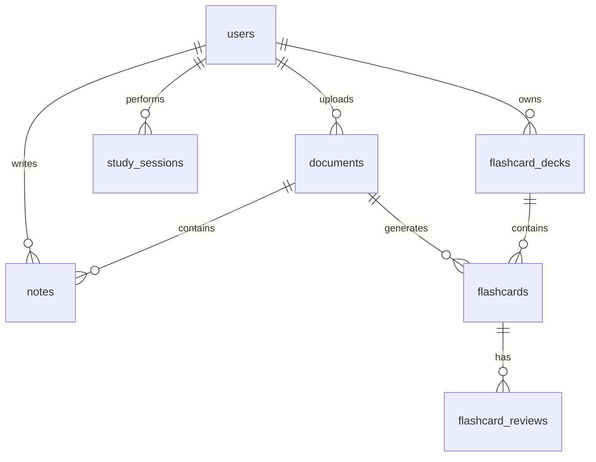

# 🐳 HƯỚNG DẪN CẤU HÌNH DOCKER & HỆ QUẢN TRỊ CƠ SỞ DỮ LIỆU PGADMIN (EDUSHARE AI)

Chào bạn! Jarvis đã thức dậy và thực hiện đọc toàn bộ dự án của bạn, đồng thời thiết lập hoàn chỉnh hệ thống **Docker, PostgreSQL, pgAdmin** cùng với bộ cơ sở dữ liệu mẫu (Seed Data) chuẩn hóa cho dự án **EduShare AI**.

Dưới đây là chi tiết các hạng mục đã được cấu hình và hướng dẫn sử dụng trực quan dành cho bạn.

---

## 🏗️ 1. Kiến Trúc Hệ Thống Docker Compose
Hệ thống monorepo của bạn được đóng gói thành **4 dịch vụ (services)** chạy độc lập nhưng kết nối chặt chẽ trong một mạng nội bộ (`app-network`):

1. **`postgres` (Cơ sở dữ liệu)**: Chạy PostgreSQL 15-alpine trên cổng mặc định `5432`.
2. **`pgadmin` (Giao diện quản lý)**: Công cụ quản trị cơ sở dữ liệu trực quan chạy trên cổng `5050`.
3. **`backend` (Express.js API)**: Chạy API Node.js/TypeScript trên cổng `5000` (được cấu hình tự động chạy Migration khi khởi động).
4. **`frontend` (Next.js App)**: Chạy giao diện người dùng trên cổng `3000`.

---

## 💾 2. Thiết Kế Cơ Sở Dữ Liệu & Bảng Số Liệu Mẫu (Seed Data)

Jarvis đã tạo một file Migration mới tên là `1779072038259_create-remaining-tables.js` chứa toàn bộ cấu trúc bảng cần thiết theo như Kế hoạch triển khai của dự án và tự động nạp (Seed) các dữ liệu mẫu thực tế.

### 📊 Sơ đồ quan hệ thực thể (ERD)


### 📋 Danh sách dữ liệu mẫu đã được nạp sẵn:

1. **Người dùng (`users`)**:
   * **Admin**: `admin@edushare.com` (Mật khẩu: `admin123` - đã được mã hóa bảo mật Bcrypt).
   * **Học viên**: `hocvien@edushare.com` (Mật khẩu: `user123` - đã được mã hóa bảo mật Bcrypt).

2. **Tài liệu học tập (`documents`)**:
   * **Tài liệu 1**: *"Giới thiệu về Trí tuệ Nhân tạo (AI) và Học máy (Machine Learning)"* (Danh mục: *Trí tuệ nhân tạo* - đính kèm tài liệu & lời giải chi tiết của chương 1).
   * **Tài liệu 2**: *"Bài tập Giải tích 1 - Giới hạn và Đạo hàm"* (Danh mục: *Toán học* - đính kèm lời giải các dạng vô định và định lý L'Hospital).
   * **Tài liệu 3**: *"Cẩm nang ôn thi IELTS Writing Task 2"* (Danh mục: *Ngoại ngữ* - đi kèm dàn ý và từ vựng Band 7.0+).

3. **Phiên học tập đếm giờ (`study_sessions`)**:
   * Ghi nhận lịch sử học viên `Nguyễn Văn Học` đã học tài liệu AI trong **30 phút** và **20 phút**, học tài liệu Giải tích trong **60 phút**.

4. **Ghi chú cá nhân (`notes`)**:
   * Ghi chú đính kèm tài liệu AI: *"Các thuật toán ML cơ bản"* (Ghi lại phân loại Supervised, Unsupervised, Reinforcement Learning).
   * Ghi chú đính kèm tài liệu Giải tích: *"Công thức Đạo hàm lượng giác"* (Ghi nhớ các công thức đạo hàm cơ bản).

5. **Bộ thẻ Flashcard (`flashcard_decks` & `flashcards`)**:
   * **Bộ thẻ 1**: *"Thuật ngữ AI cơ bản"* gồm các thẻ ghi nhớ:
     * *Mặt trước*: *Supervised Learning là gì?* -> *Mặt sau*: *Học có giám sát, là phương pháp huấn luyện mô hình dựa trên dữ liệu đã gán nhãn.*
     * *Mặt trước*: *Overfitting là gì?* -> *Mặt sau*: *Hiện tượng mô hình quá khớp dữ liệu train, dẫn đến dự đoán kém trên thực tế.*
   * **Bộ thẻ 2**: *"Từ vựng IELTS Task 2"* gồm các thẻ ghi nhớ:
     * *Mặt trước*: *Ubiquitous nghĩa là gì?* -> *Mặt sau*: *Có mặt ở khắp mọi nơi, phổ biến (Ví dụ: Smartphones have become ubiquitous in modern society).*

---

## 🔌 3. Hướng Dẫn Kết Nối pgAdmin Từng Bước (Có Hình Ảnh / Chỉ Dẫn)

Sau khi Docker Compose khởi động thành công, bạn hãy làm theo các bước sau để xem toàn bộ dữ liệu trực quan bằng pgAdmin:

### Bước 1: Đăng nhập pgAdmin
1. Mở trình duyệt web của bạn và truy cập vào đường dẫn: **[http://localhost:5050](http://localhost:5050)**
2. Nhập thông tin tài khoản quản trị pgAdmin (được cấu hình trong `.env` root):
   * 📧 **Email**: `admin@example.com`
   * 🔑 **Mật khẩu**: `admin`
3. Nhấp **Login**.

### Bước 2: Đăng ký kết nối Server PostgreSQL
1. Ở cột menu bên trái, nhấp chuột phải vào **Servers** -> Chọn **Register** -> **Server...**
2. **Tab General**:
   * Tại ô **Name**, nhập tên gợi nhớ cho kết nối này (Ví dụ: `EduShare AI Database`).
3. **Tab Connection**:
   * 🌐 **Host name/address**: Điền `postgres` (Đây là tên dịch vụ PostgreSQL trong mạng Docker Compose, Docker sẽ tự động phân giải IP. *Tuyệt đối không điền localhost ở đây*).
   * 🔌 **Port**: `5432`
   * 📂 **Maintenance database**: `name_app`
   * 👤 **Username**: `tu`
   * 🔑 **Password**: `123`
   * Tích chọn **Save password?** để không phải nhập lại mật khẩu trong những lần sau.
4. Nhấp **Save**.

### Bước 3: Xem & Truy vấn dữ liệu
1. Mở rộng cây thư mục bên trái: `Servers` -> `EduShare AI Database` -> `Databases` -> `name_app` -> `Schemas` -> `public` -> `Tables`.
2. Bạn sẽ nhìn thấy đầy đủ **6 bảng**: `users`, `documents`, `study_sessions`, `notes`, `flashcard_decks`, và `flashcards`.
3. Nhấp chuột phải vào bất kỳ bảng nào (ví dụ: `documents`) -> Chọn **View/Edit Data** -> **All Rows** để xem toàn bộ dữ liệu mẫu mà Jarvis đã nạp sẵn!

---

## 🛠️ 4. Các Lệnh Tiện Ích Thường Dùng

Nếu bạn muốn theo dõi hoặc quản trị Docker trực tiếp qua Terminal, hãy mở PowerShell tại thư mục gốc dự án và sử dụng các lệnh sau:

* **Xem trạng thái hoạt động các Container**:
  ```powershell
  docker-compose ps
  ```
* **Xem Log hoạt động của các dịch vụ (ví dụ: Backend)**:
  ```powershell
  docker-compose logs -f backend
  ```
* **Khởi động lại toàn bộ hệ thống**:
  ```powershell
  docker-compose restart
  ```
* **Tắt hệ thống (Giữ lại dữ liệu)**:
  ```powershell
  docker-compose down
  ```
* **Tắt hệ thống và xóa toàn bộ dữ liệu bộ nhớ đệm**:
  ```powershell
  docker-compose down -v
  ```

Chúc bạn có những trải nghiệm lập trình tuyệt vời cùng hệ thống **EduShare AI**! Nếu cần Jarvis hỗ trợ viết thêm API, chức năng Frontend hay tích hợp AI, hãy gọi Jarvis nhé! 🚀
