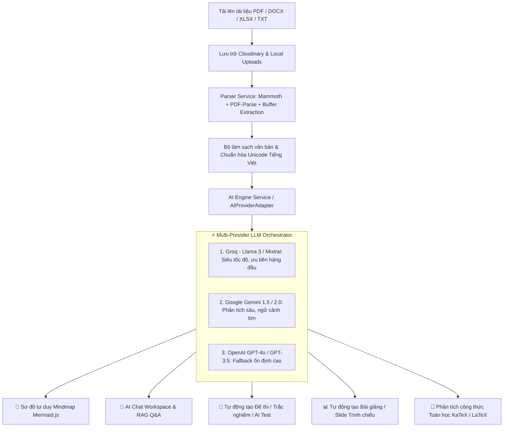

# 🧠 Cognito AI & Document Processing Architecture (AI-Document)

> **Tài liệu toàn diện về Hệ thống Trí tuệ Nhân tạo & Xử lý Tài liệu thông minh trong Cognito**  
> *Cập nhật lần cuối: 27/09/2026*

---

## 📌 1. Tổng quan Kiến trúc AI (AI Architecture Overview)

Hệ sinh thái Cognito tích hợp hệ thống xử lý tài liệu thông minh kết hợp mạng lưới mô hình ngôn ngữ lớn (Multi-Provider LLM Gateway) để tự động hóa toàn bộ quy trình học tập và giảng dạy:



---

## ⚙️ 2. Các Thành phần Cốt lõi (Core Components)

### 2.1. Multi-Provider AI Engine (`backend/src/utils/ai-engine.service.ts` & `ai-provider.service.ts`)
- **Chiến lược định tuyến thông minh (Smart Fallback & Routing):**
  1. **Primary Provider: Groq** (tốc độ phản hồi cực nhanh ~500ms, tối ưu cho Mindmap & Chat trực tiếp).
  2. **Secondary Provider: Google Gemini** (hỗ trợ context window lớn, xử lý tài liệu dài hàng chục trang).
  3. **Tertiary Fallback: OpenAI** (đảm bảo dịch vụ 99.9% uptime khi các provider khác gặp rate limit).
- **Phân loại Task Types:**
  - `mindmap`: Sinh sơ đồ tư duy có cấu trúc phân nhánh đa cấp.
  - `quiz_generation`: Sinh bộ câu hỏi trắc nghiệm/tự luận kèm đáp án và giải thích chi tiết.
  - `presentation`: Phân tích tài liệu thành các slide bài giảng với mục tiêu học tập, dàn ý và speaker notes.
  - `qa_chat`: Trả lời thắc mắc dựa trên ngữ cảnh tài liệu đã tải lên.

### 2.2. Trình phân tích & Trích xuất Tài liệu (`backend/src/services/parser.service.ts`)
- **Hỗ trợ đa định dạng:**
  - `.pdf`: Trích xuất text đa trang qua `pdf-parse` và chuyển đổi sang ảnh slide độ nét cao (2x DPI) qua `pdf-to-png-converter`.
  - `.docx` / `.doc`: Trích xuất text có cấu trúc qua thư viện `mammoth`, hỗ trợ trích xuất văn bản sạch và các ký hiệu toán học.
  - `.xlsx` / `.xls` / `.csv`: Đọc bảng dữ liệu dạng ma trận text.
  - `.txt` / Markdown: Xử lý định dạng UTF-8 tự nhiên.
- **Bộ chuẩn hóa Unicode Tiếng Việt (`cleanVietnameseText`):**
  - Tự động sửa lỗi tổ hợp ký tự tiếng Việt (NFD -> NFC).
  - Loại bỏ các thẻ HTML rác và ký tự vô nghĩa trước khi đưa vào LLM context window.

### 2.3. Trình tạo Sơ đồ Tư duy (`generateMindmapWithAI` & `MermaidViewer.tsx`)
- **Quy chuẩn thiết kế sơ đồ:**
  - Nút gốc (`root((Tên Chủ Đề))`) trích xuất đúng trọng tâm bài học.
  - Phân nhánh 4 - 6 trụ cột nội dung cấp 1, cấp 2 và cấp 3 cụ thể, cấm sử dụng các từ ngữ sáo rỗng vô nghĩa.
  - Thuật toán `sanitizeMindmapCode` tự động chuẩn hóa thụt dòng (indentation levels) và loại bỏ ký tự đặc biệt gây sập cú pháp Mermaid.
  - Cơ chế tự động dọn dẹp các thẻ SVG lỗi (`suppressErrorRendering` & rogue DOM element cleanup).

### 2.4. Hệ thống Tạo & Trình chiếu Bài giảng (`LectureService` & Teacher Studio)
- **2 Chế độ hoạt động:**
  1. **ORIGINAL Mode (Trình chiếu nguyên bản):** Tự động chuyển đổi từng trang tài liệu PDF sang ảnh PNG độ phân giải cao (`uploads/slides/{id}/page_{n}.png`), hiển thị sắc nét với trình chiếu full-screen, presenter notes và công cụ tương tác.
  2. **AI GENERATED Mode (Bài giảng thông minh):** AI tự động phân tích dàn ý, tạo tiêu đề bài học, tóm tắt các điểm nhấn (callout blocks), nội dung giảng dạy và speaker notes cho từng slide.

### 2.5. Hiển thị Công thức Toán học KaTeX (`DocxPreviewRenderer.tsx` & `math.ts`)
- Tích hợp bộ chuyển đổi tự động các công thức toán dạng LaTeX (`$...$`, `$$...$$`, `\(...\)`, `\[...\]`) trong các tài liệu Word/PDF preview.

---

## 📡 3. Danh mục API AI & Tài liệu (API Reference)

| Phương thức | Endpoint | Chức năng | Tham số chính |
|---|---|---|---|
| `POST` | `/api/ai/mindmap` | Tạo sơ đồ tư duy Mermaid từ tài liệu | `{ documentId, content, title }` |
| `POST` | `/api/ai/quiz/generate` | Tạo bộ câu hỏi trắc nghiệm/tự luận | `{ documentId, count, difficulty, topic }` |
| `POST` | `/api/ai/chat` | AI Chat Workspace tra cứu theo tài liệu | `{ documentId, messages: [...] }` |
| `POST` | `/api/ai/explain` | Giải thích khái niệm chuyên sâu | `{ text, context }` |
| `POST` | `/api/documents/upload` | Tải lên tài liệu đa định dạng & phân tích | `FormData (file, title, folderId)` |
| `GET` | `/api/documents/:id/preview` | Lấy dữ liệu xem trước & text phân tích | `id: number` |
| `POST` | `/api/lectures/create` | Tạo bài giảng / slide từ tài liệu | `{ mode: 'ORIGINAL' \| 'AI', file, title }` |
| `GET` | `/api/lectures/:id` | Lấy chi tiết bài giảng kèm slide images | `id: number` |

---

## 📂 4. Cấu trúc Thư mục AI & Tài liệu (Directory Structure)

```
Cognito/
├── backend/
│   ├── src/
│   │   ├── controllers/
│   │   │   ├── ai.controller.ts          # Điều phối các API AI (Mindmap, Quiz, Chat)
│   │   └── document.controller.ts    # Xử lý upload, phân tích và quản lý file
│   │   ├── services/
│   │   │   ├── ai.service.ts             # Nghiệp vụ xử lý AI cấp cao
│   │   │   ├── ai-provider.service.ts    # Multi-provider adapter (Groq, Gemini, OpenAI)
│   │   │   ├── lecture.service.ts        # Tạo slide & chuyển đổi PDF to PNG
│   │   │   └── parser.service.ts         # Trích xuất nội dung DOCX, PDF, XLSX
│   │   └── utils/
│   │       └── ai-engine.service.ts      # Prompt templates & chuẩn hóa Mermaid mindmap
│
├── frontend/
│   ├── src/
│   │   ├── app/
│   │   │   ├── teacher/presentation/[id]/ # Giao diện trình chiếu Slide toàn màn hình
│   │   │   ├── teacher/studio/            # Studio biên soạn và tạo slide bài giảng
│   │   │   └── viewer/[id]/               # Xem chi tiết tài liệu học tập
│   │   ├── components/documents/
│   │   │   ├── AIChatWorkspace.tsx        # Khung chat AI tương tác với tài liệu
│   │   │   ├── DocumentViewerWrapper.tsx  # Trình xem tài liệu PDF, DOCX, XLSX
│   │   │   ├── DocxPreviewRenderer.tsx    # Renderer Word DOCX kèm KaTeX Math
│   │   │   └── MermaidViewer.tsx          # Renderer Sơ đồ tư duy Mermaid.js
│   │   └── utils/
│   │       └── math.ts                    # Tiện ích render công thức toán LaTeX
```

---

## 🔑 5. Biến Môi trường AI (Environment Variables)

Được cấu hình trong `backend/.env`:

```env
# Groq API Configuration (Fast Inference)
GROQ_API_KEY=gsk_xxxxxxxxxxxxxxxxxxxx
GROQ_MODEL=llama-3.3-70b-versatile

# Google Gemini API Configuration
GEMINI_API_KEY=AIzaxxxxxxxxxxxxxxxxxxxx
GEMINI_MODEL=gemini-1.5-flash

# OpenAI API Configuration (Fallback)
OPENAI_API_KEY=sk-xxxxxxxxxxxxxxxxxxxx
OPENAI_MODEL=gpt-4o-mini

# Cloudinary Storage Configuration
CLOUDINARY_CLOUD_NAME=xxxxxxxx
CLOUDINARY_API_KEY=xxxxxxxx
CLOUDINARY_API_SECRET=xxxxxxxx
```

---

## 🚀 6. Hướng dẫn Kiểm thử & Vận hành (Testing & Verification)

1. **Khởi động Backend:**
   ```bash
   cd backend
   npm run dev
   ```
2. **Khởi động Frontend:**
   ```bash
   cd frontend
   npm run dev
   ```
3. **Kiểm tra tính năng:**
   - Tải lên tài liệu `.pdf` hoặc `.docx` trong Thư viện tài liệu.
   - Mở tab **Sơ đồ tư duy (Mindmap)** để kiểm tra tốc độ sinh và độ chính xác của sơ đồ.
   - Vào phần **Teacher Studio**, tạo bài giảng từ tài liệu PDF để kiểm tra cơ chế tự động chuyển đổi slide PNG và trình chiếu.
   - Mở **AI Chat Workspace** để hỏi đáp trực tiếp theo nội dung bài học.
